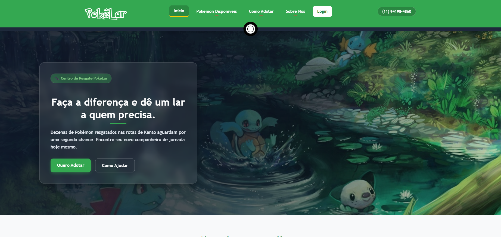

# PokéLar - Centro de Resgate e Adoção Pokémon

Projeto desenvolvido para a disciplina de SCOM. O **PokéLar** é um site fictício de uma instituição dedicada ao resgate, reabilitação e adoção responsável de Pokémon na região de Kanto.

---

## Prévia do Projeto

---

## Páginas

- **Início (`index.html`)**: Apresentação da instituição, indicadores de impacto e depoimentos de tutores.
- **Pokémon Disponíveis (`pokemon.html`)**: Catálogo de Pokémon para adoção com barra de busca e filtros por tipo e porte.
- **Como Adotar (`como-adotar.html`)**: Passo a passo com orientações e critérios para adoção.
- **Sobre Nós (`sobre.html`)**: Informações sobre a equipe, estrutura do centro e missão da ONG.
- **Login (`login.html`)**: Formulário de autenticação para voluntários e adotantes.

---

## Estrutura de Arquivos

.
├── css/
│   └── style.css
├── fonts/
├── img/
├── index.html
├── pokemon.html
├── como-adotar.html
├── sobre.html
├── login.html
├── modelo.html
└── README.md

## Instruções de Inicialização e Execução

Por se tratar de um projeto construído com HTML e CSS puros, não é necessária a instalação de dependências, pacotes ou etapas de compilação.

### Como abrir o projeto:

#### Opção 1: Acesse o link do GitHub Pages
1. Abra o seguinte link: https://zugs007.github.io/Trabalho-Individual-I---Bruno-Sciamarelli-Torso/
2. Acesse o site livremente pela hospedagem do próprio GitHub (não é uma hospedagem local, em caso de testes específicos)

#### Opção 2: VS Code com Live Server
1. Abra a pasta do projeto no **VS Code**.
2. Clique com o botão direito sobre o arquivo `index.html`.
3. Selecione **"Open with Live Server"**.

#### Opção 3: Abertura Direta no Navegador
1. Navegue até a pasta do projeto no seu computador.
2. Dê um duplo clique no arquivo `index.html` para abri-lo em qualquer navegador (Chrome, Edge, Firefox, Safari).